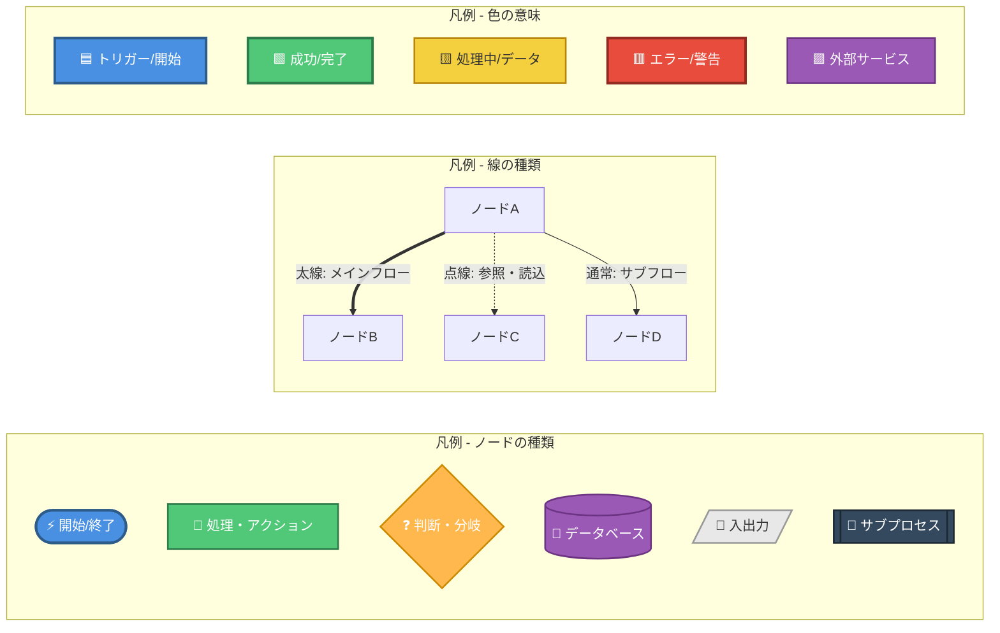
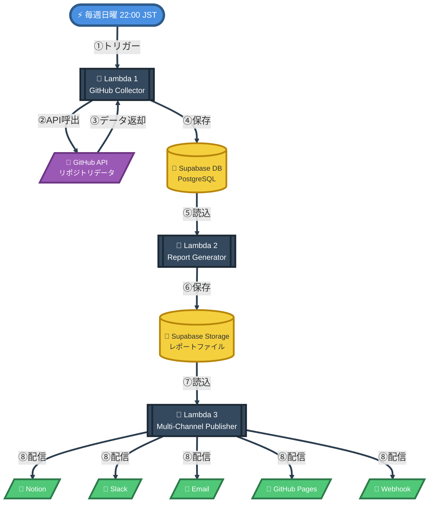
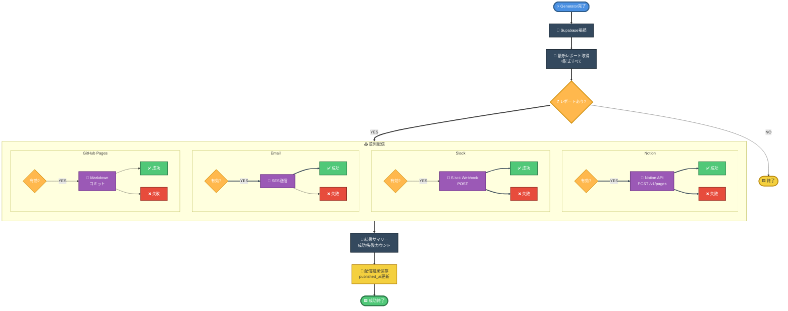
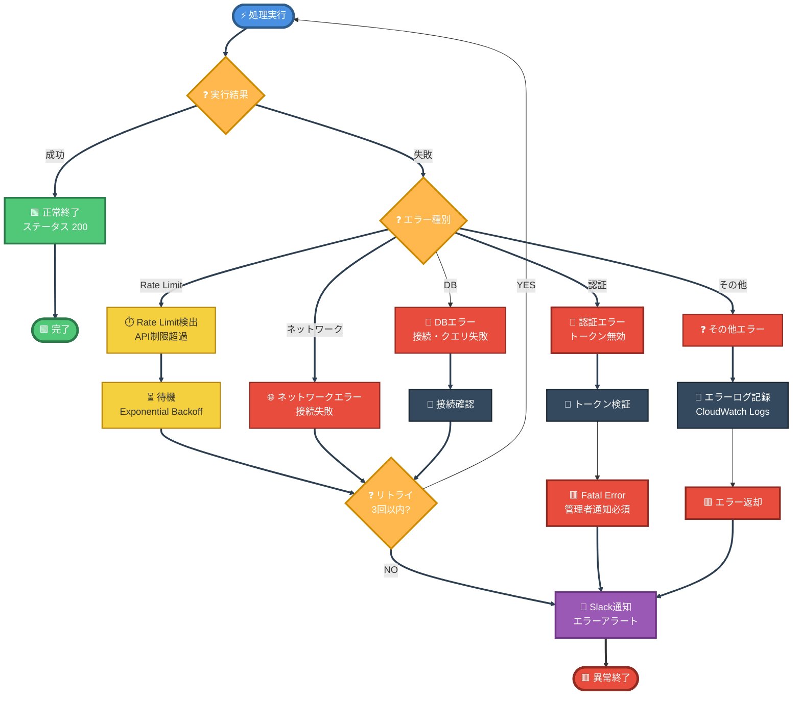
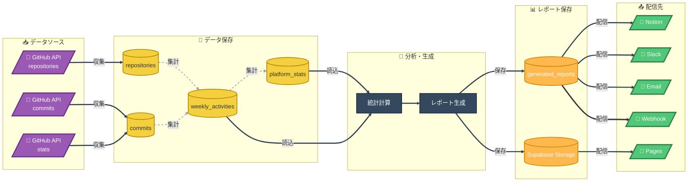

# GitHub Activity Aggregator - システムフロー図

> **視覚的に理解しやすいフロー図で、システム全体の動作を明確に把握**

---

## 📖 このドキュメントについて

このドキュメントは、GitHub Activity Aggregatorの処理フローを**誰が見ても理解できる**ように視覚化しています。

### 🎨 図の見方（共通凡例）



---

## 🌟 1. システム全体フロー【最重要】

> **このシステムの全体像を一目で理解**



### 📊 処理フェーズ

| フェーズ | Lambda関数 | 処理内容 | 所要時間 |
|---------|-----------|---------|---------|
| **①** | Collector | GitHub APIからデータ収集 | 30-60秒 |
| **②** | Generator | データ分析・レポート生成 | 10-20秒 |
| **③** | Publisher | 複数チャネルに配信 | 5-10秒 |

**合計実行時間**: 約45-90秒

---

## 🔄 2. Lambda 1: GitHub Collector（データ収集）

> **GitHubから全リポジトリのデータを取得**

```mermaid
flowchart TD
    START([⚡ EventBridge<br/>トリガー])

    %% 初期化
    INIT[🔧 初期化<br/>環境変数読込]

    %% メイン処理
    FETCH_REPOS[🔧 全リポジトリ取得<br/>GET /user/repos]
    CHECK_REPOS{❓ 取得成功?}

    %% エラーハンドリング
    ERROR[🟥 エラー処理<br/>ログ記録・リトライ]
    FAIL([🟥 失敗終了])

    %% リポジトリ保存
    SAVE_REPOS[💾 リポジトリ情報保存<br/>repositories テーブル]

    %% 日付計算
    CALC_DATE[🔧 期間計算<br/>先週分 7日間]

    %% コミット取得ループ
    LOOP_START{❓ 各リポジトリを<br/>順次処理}
    FETCH_COMMITS[🔧 コミット取得<br/>GET /repos/.../commits]
    CHECK_COMMITS{❓ コミット<br/>あり?}
    FETCH_DETAILS[🔧 詳細取得<br/>stats情報含む]
    SAVE_COMMITS[💾 コミット保存<br/>commits テーブル]
    CHECK_NEXT{❓ 次あり?}

    %% 集計処理
    AGGREGATE[🔧 週次集計作成<br/>weekly_activities]
    CALC_STATS[🔧 統計計算<br/>総数・言語分布]
    SAVE_STATS[💾 統計保存<br/>platform_stats]

    %% 次のLambdaトリガー
    TRIGGER[🎯 Generator起動]
    SUCCESS([🟩 成功終了])

    %% フロー定義
    START ==> INIT
    INIT ==> FETCH_REPOS
    FETCH_REPOS ==> CHECK_REPOS

    CHECK_REPOS -->|NO| ERROR
    ERROR --> FAIL

    CHECK_REPOS ==>|YES| SAVE_REPOS
    SAVE_REPOS ==> CALC_DATE
    CALC_DATE ==> LOOP_START

    LOOP_START ==> FETCH_COMMITS
    FETCH_COMMITS ==> CHECK_COMMITS

    CHECK_COMMITS -->|NO| CHECK_NEXT
    CHECK_COMMITS ==>|YES| FETCH_DETAILS
    FETCH_DETAILS ==> SAVE_COMMITS
    SAVE_COMMITS ==> CHECK_NEXT

    CHECK_NEXT -->|YES| LOOP_START
    CHECK_NEXT ==>|NO| AGGREGATE

    AGGREGATE ==> CALC_STATS
    CALC_STATS ==> SAVE_STATS
    SAVE_STATS ==> TRIGGER
    TRIGGER ==> SUCCESS

    %% スタイル
    style START fill:#4A90E2,stroke:#2E5C8A,stroke-width:4px,color:#fff
    style SUCCESS fill:#50C878,stroke:#2D7A4A,stroke-width:4px,color:#fff
    style FAIL fill:#E74C3C,stroke:#922B21,stroke-width:4px,color:#fff

    style INIT fill:#34495E,stroke:#1C2833,stroke-width:2px,color:#fff
    style FETCH_REPOS fill:#34495E,stroke:#1C2833,stroke-width:2px,color:#fff
    style CALC_DATE fill:#34495E,stroke:#1C2833,stroke-width:2px,color:#fff
    style FETCH_COMMITS fill:#34495E,stroke:#1C2833,stroke-width:2px,color:#fff
    style FETCH_DETAILS fill:#34495E,stroke:#1C2833,stroke-width:2px,color:#fff
    style AGGREGATE fill:#34495E,stroke:#1C2833,stroke-width:2px,color:#fff
    style CALC_STATS fill:#34495E,stroke:#1C2833,stroke-width:2px,color:#fff

    style CHECK_REPOS fill:#FFB84D,stroke:#CC8A00,stroke-width:3px,color:#fff
    style CHECK_COMMITS fill:#FFB84D,stroke:#CC8A00,stroke-width:3px,color:#fff
    style CHECK_NEXT fill:#FFB84D,stroke:#CC8A00,stroke-width:3px,color:#fff
    style LOOP_START fill:#FFB84D,stroke:#CC8A00,stroke-width:3px,color:#fff

    style SAVE_REPOS fill:#F4D03F,stroke:#B8860B,stroke-width:2px,color:#333
    style SAVE_COMMITS fill:#F4D03F,stroke:#B8860B,stroke-width:2px,color:#333
    style SAVE_STATS fill:#F4D03F,stroke:#B8860B,stroke-width:2px,color:#333

    style ERROR fill:#E74C3C,stroke:#922B21,stroke-width:3px,color:#fff
    style TRIGGER fill:#9B59B6,stroke:#6C3483,stroke-width:2px,color:#fff

    linkStyle 0,1,2,4,5,6,7,9,10,11,12,14,15,16,17,18 stroke:#2C3E50,stroke-width:3px
```



### 📋 処理ステップ

1. **初期化**: GitHub Token、Supabase認証情報の読込
2. **リポジトリ取得**: 全リポジトリ一覧を取得（最大100件/リクエスト）
3. **コミット取得**: 各リポジトリの先週分コミットを取得
4. **詳細取得**: コミットごとのstats（追加/削除行数）を取得
5. **データ保存**: Supabaseに保存（repositories, commits, weekly_activities）
6. **集計処理**: 統計データを計算・保存

---

## 📝 3. Lambda 2: Report Generator（レポート生成）

> **収集データを分析し、複数フォーマットのレポート生成**

```mermaid
flowchart TD
    START([⚡ Collector完了])

    %% 初期化
    INIT[🔧 Supabase接続]
    SET_PERIOD[🔧 期間設定<br/>先週月曜〜日曜]

    %% データ取得
    QUERY[🔧 週次データ取得<br/>SELECT FROM weekly_activities]
    CHECK_DATA{❓ データあり?}

    %% データなし
    EMPTY[🔧 空レポート生成]
    END_EMPTY([🟨 終了])

    %% 統計計算
    CALC[🔧 統計計算<br/>コミット数・言語分布など]

    %% レポート生成（並列処理）
    subgraph GENERATE["📊 レポート生成（並列）"]
        GEN_NOTION[📝 Notion形式]
        GEN_MD[📝 Markdown形式]
        GEN_JSON[📝 JSON形式]
        GEN_SLACK[📝 Slack形式]
    end

    %% 保存
    SAVE_DB[💾 DB保存<br/>generated_reports]
    SAVE_STORAGE[💾 Storage保存<br/>reports/{date}/]

    %% 次のLambdaトリガー
    TRIGGER[🎯 Publisher起動]
    SUCCESS([🟩 成功終了])

    %% フロー
    START ==> INIT
    INIT ==> SET_PERIOD
    SET_PERIOD ==> QUERY
    QUERY ==> CHECK_DATA

    CHECK_DATA -->|NO| EMPTY
    EMPTY --> END_EMPTY

    CHECK_DATA ==>|YES| CALC
    CALC ==> GENERATE

    GENERATE ==> SAVE_DB
    SAVE_DB ==> SAVE_STORAGE
    SAVE_STORAGE ==> TRIGGER
    TRIGGER ==> SUCCESS

    %% スタイル
    style START fill:#4A90E2,stroke:#2E5C8A,stroke-width:4px,color:#fff
    style SUCCESS fill:#50C878,stroke:#2D7A4A,stroke-width:4px,color:#fff
    style END_EMPTY fill:#F4D03F,stroke:#B8860B,stroke-width:3px,color:#333

    style INIT fill:#34495E,stroke:#1C2833,stroke-width:2px,color:#fff
    style SET_PERIOD fill:#34495E,stroke:#1C2833,stroke-width:2px,color:#fff
    style QUERY fill:#34495E,stroke:#1C2833,stroke-width:2px,color:#fff
    style CALC fill:#34495E,stroke:#1C2833,stroke-width:2px,color:#fff
    style EMPTY fill:#34495E,stroke:#1C2833,stroke-width:2px,color:#fff

    style CHECK_DATA fill:#FFB84D,stroke:#CC8A00,stroke-width:3px,color:#fff

    style GEN_NOTION fill:#9B59B6,stroke:#6C3483,stroke-width:2px,color:#fff
    style GEN_MD fill:#9B59B6,stroke:#6C3483,stroke-width:2px,color:#fff
    style GEN_JSON fill:#9B59B6,stroke:#6C3483,stroke-width:2px,color:#fff
    style GEN_SLACK fill:#9B59B6,stroke:#6C3483,stroke-width:2px,color:#fff

    style SAVE_DB fill:#F4D03F,stroke:#B8860B,stroke-width:2px,color:#333
    style SAVE_STORAGE fill:#F4D03F,stroke:#B8860B,stroke-width:2px,color:#333

    style TRIGGER fill:#9B59B6,stroke:#6C3483,stroke-width:2px,color:#fff

    linkStyle 0,1,2,3,5,6,7,8,9,10 stroke:#2C3E50,stroke-width:3px
```

### 📊 生成レポート形式

| 形式 | 用途 | 出力内容 |
|-----|------|---------|
| **Notion** | 進捗管理DB | Database properties + Content blocks |
| **Markdown** | GitHub Pages | 見出し・リスト・表形式 |
| **JSON** | API連携 | 構造化データ（REST API用） |
| **Slack** | 通知 | Blocks API（リッチメッセージ） |

---

## 📤 4. Lambda 3: Multi-Channel Publisher（配信）

> **生成されたレポートを各サービスに配信**



### 📤 配信先一覧

| サービス | 配信内容 | 環境変数 |
|---------|---------|---------|
| **Notion** | Databaseページ作成 | `NOTION_ENABLED=true` |
| **Slack** | Webhookでメッセージ送信 | `SLACK_ENABLED=true` |
| **Email** | SES経由でメール送信 | `EMAIL_ENABLED=true` |
| **GitHub Pages** | Markdownをリポジトリにコミット | `PAGES_ENABLED=true` |
| **Webhook** | カスタムエンドポイントに送信 | `WEBHOOK_ENABLED=true` |

---

## ⏱️ 5. 実行タイムライン（週次）

> **処理の時系列を可視化**

```mermaid
gantt
    title 週次実行タイムライン（日曜 22:00 JST 開始）
    dateFormat HH:mm:ss
    axisFormat %H:%M:%S

    section ⚡ Trigger
    EventBridge発火        :milestone, trigger, 22:00:00, 0s

    section 🤖 Collector
    初期化                :done, c1, 22:00:00, 5s
    全リポジトリ取得      :done, c2, after c1, 10s
    コミット詳細取得      :active, c3, after c2, 30s
    DB保存・集計          :done, c4, after c3, 15s

    section 🤖 Generator
    データ読込            :done, g1, after c4, 5s
    統計計算              :done, g2, after g1, 5s
    レポート生成（並列）  :active, g3, after g2, 10s

    section 🤖 Publisher
    並列配信処理          :active, p1, after g3, 10s
    結果記録              :done, p2, after p1, 5s

    section ✅ Complete
    全処理完了            :milestone, complete, after p2, 0s
```



### ⏰ 実行時間目安

| Lambda関数 | 処理時間 | 備考 |
|-----------|---------|------|
| Collector | 30-60秒 | リポジトリ数に依存 |
| Generator | 10-20秒 | コミット数に依存 |
| Publisher | 5-10秒 | 配信先数に依存 |
| **合計** | **45-90秒** | 通常1分程度 |

---

## 🔐 6. エラーハンドリングフロー

> **エラー種別ごとの処理を明確化**



### 🚨 エラー対応表

| エラー種別 | リトライ | 通知 | 対応方法 |
|-----------|---------|------|---------|
| **API Rate Limit** | ⭕ 3回 | ⚠️ 3回失敗後 | Exponential Backoff待機 |
| **認証エラー** | ❌ なし | 🚨 即座 | トークン再発行必要 |
| **ネットワークエラー** | ⭕ 3回 | ⚠️ 3回失敗後 | 自動リトライ |
| **DBエラー** | ⭕ 3回 | ⚠️ 3回失敗後 | 接続状態確認 |
| **その他** | ❌ なし | 📝 ログのみ | ログ確認・調査 |

---

## 🗄️ 7. データフロー全体像

> **データソースから配信先までの流れ**



### 📊 データテーブル一覧

| テーブル名 | 役割 | 更新頻度 |
|-----------|------|---------|
| **repositories** | リポジトリマスタ | 週次（UPSERT） |
| **commits** | コミット履歴 | 週次（INSERT） |
| **weekly_activities** | 週次集計データ | 週次（UPSERT） |
| **platform_stats** | 統計情報 | 週次（INSERT） |
| **generated_reports** | 生成レポート | 週次（INSERT） |

---

## 🚀 8. 実装フェーズ

> **開発ステップを段階的に可視化**

```mermaid
graph TD
    START([🎬 プロジェクト開始])

    %% Phase 1
    P1[📦 Phase 1: 基盤構築<br/>━━━━━━━━━━━━━━<br/>✓ Supabase DB設計<br/>✓ Lambda基本実装<br/>✓ ローカルテスト]
    C1{✅ 動作確認}

    %% Phase 2
    P2[🔄 Phase 2: データ収集<br/>━━━━━━━━━━━━━━<br/>✓ GitHub API統合<br/>✓ Collector実装<br/>✓ エラーハンドリング]
    C2{✅ テスト成功?}

    %% Phase 3
    P3[📝 Phase 3: レポート生成<br/>━━━━━━━━━━━━━━<br/>✓ Generator実装<br/>✓ 複数フォーマット対応<br/>✓ テンプレート作成]
    C3{✅ レポート品質OK?}

    %% Phase 4
    P4[📤 Phase 4: 配信機能<br/>━━━━━━━━━━━━━━<br/>✓ Publisher実装<br/>✓ API統合<br/>✓ 通知機能]
    C4{✅ 配信成功?}

    %% Phase 5
    P5[🚀 Phase 5: デプロイ<br/>━━━━━━━━━━━━━━<br/>✓ AWS CDK構築<br/>✓ CI/CD設定<br/>✓ 本番デプロイ]
    C5{✅ 本番動作OK?}

    %% Phase 6
    P6[📊 Phase 6: 運用<br/>━━━━━━━━━━━━━━<br/>✓ モニタリング設定<br/>✓ パフォーマンス最適化<br/>✓ 機能拡張]

    COMPLETE([🎉 完成・運用開始])

    %% フロー
    START ==> P1
    P1 ==> C1
    C1 -->|NG| P1
    C1 ==>|OK| P2

    P2 ==> C2
    C2 -->|NG| P2
    C2 ==>|OK| P3

    P3 ==> C3
    C3 -->|NG| P3
    C3 ==>|OK| P4

    P4 ==> C4
    C4 -->|NG| P4
    C4 ==>|OK| P5

    P5 ==> C5
    C5 -->|NG| P5
    C5 ==>|OK| P6

    P6 ==> COMPLETE

    %% スタイル
    style START fill:#4A90E2,stroke:#2E5C8A,stroke-width:4px,color:#fff
    style COMPLETE fill:#50C878,stroke:#2D7A4A,stroke-width:4px,color:#fff

    style P1 fill:#34495E,stroke:#1C2833,stroke-width:3px,color:#fff,text-align:left
    style P2 fill:#34495E,stroke:#1C2833,stroke-width:3px,color:#fff,text-align:left
    style P3 fill:#34495E,stroke:#1C2833,stroke-width:3px,color:#fff,text-align:left
    style P4 fill:#34495E,stroke:#1C2833,stroke-width:3px,color:#fff,text-align:left
    style P5 fill:#34495E,stroke:#1C2833,stroke-width:3px,color:#fff,text-align:left
    style P6 fill:#34495E,stroke:#1C2833,stroke-width:3px,color:#fff,text-align:left

    style C1 fill:#FFB84D,stroke:#CC8A00,stroke-width:3px,color:#fff
    style C2 fill:#FFB84D,stroke:#CC8A00,stroke-width:3px,color:#fff
    style C3 fill:#FFB84D,stroke:#CC8A00,stroke-width:3px,color:#fff
    style C4 fill:#FFB84D,stroke:#CC8A00,stroke-width:3px,color:#fff
    style C5 fill:#FFB84D,stroke:#CC8A00,stroke-width:3px,color:#fff

    linkStyle 0,1,3,5,7,9,11,13 stroke:#2C3E50,stroke-width:3px
    linkStyle 2,4,6,8,10,12 stroke:#E74C3C,stroke-width:2px,stroke-dasharray:5
```



### 📅 実装スケジュール目安

| Phase | 期間 | 成果物 |
|-------|------|-------|
| **Phase 1** | 1-2週間 | DB設計・Lambda雛形 |
| **Phase 2** | 1週間 | Collector Lambda完成 |
| **Phase 3** | 1週間 | Generator Lambda完成 |
| **Phase 4** | 1週間 | Publisher Lambda完成 |
| **Phase 5** | 3日 | 本番環境デプロイ |
| **Phase 6** | 継続 | 運用・改善 |

**合計**: 約4-5週間で完成

---

## 🎯 まとめ

### ✅ このフロー図でわかること

1. **システム全体の流れ** - 3つのLambda関数の連携
2. **各Lambda関数の詳細処理** - ステップバイステップの動作
3. **データの流れ** - GitHubからNotion/Slackまで
4. **エラー対応** - リトライ・通知の仕組み
5. **実装の進め方** - 6つのPhaseで段階的に開発

### 🔍 次のステップ

- [ ] **Phase 1開始**: Supabaseのデータベース設計
- [ ] **環境構築**: AWS Lambda開発環境のセットアップ
- [ ] **GitHub API**: トークン取得とAPI動作確認

---

**最終更新**: 2025-11-17
**バージョン**: 2.0（大幅改善版）
