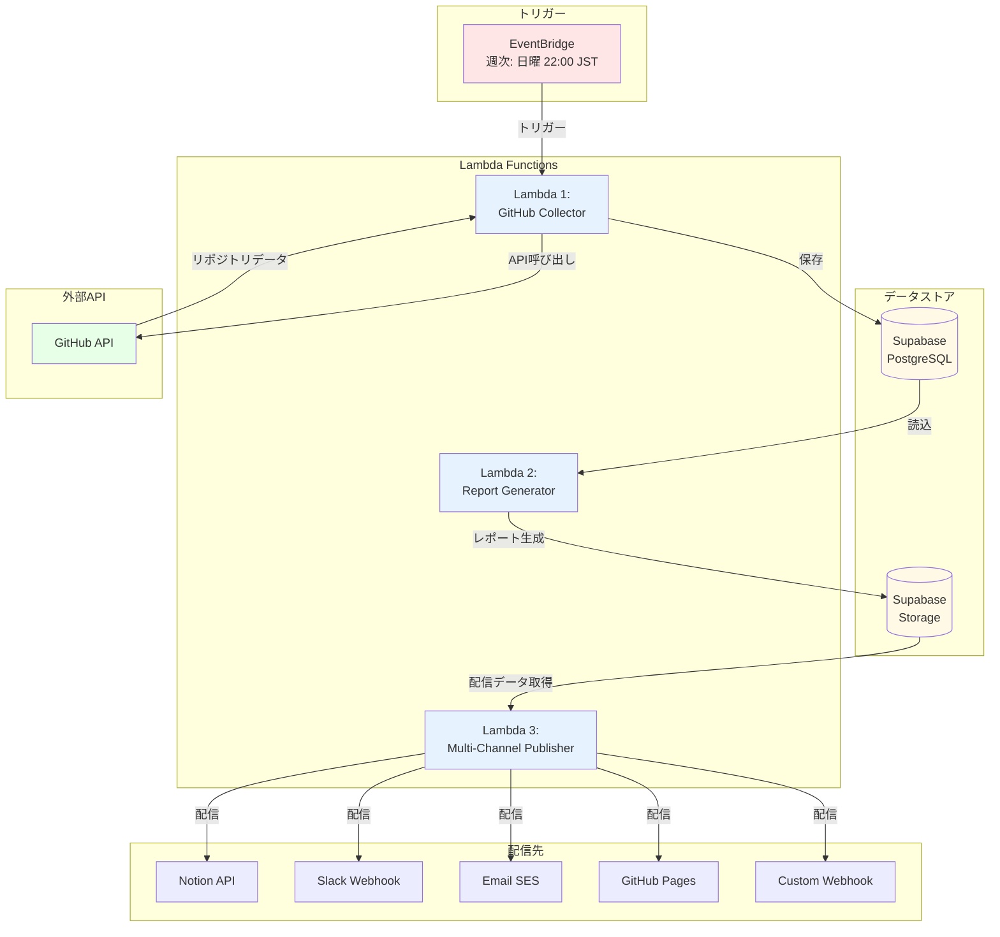
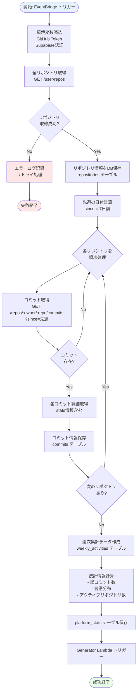
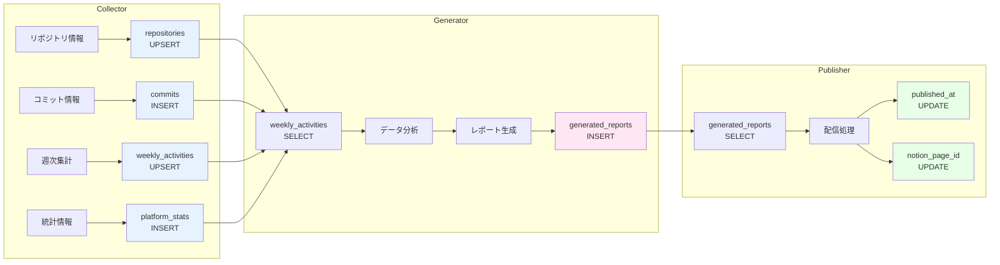
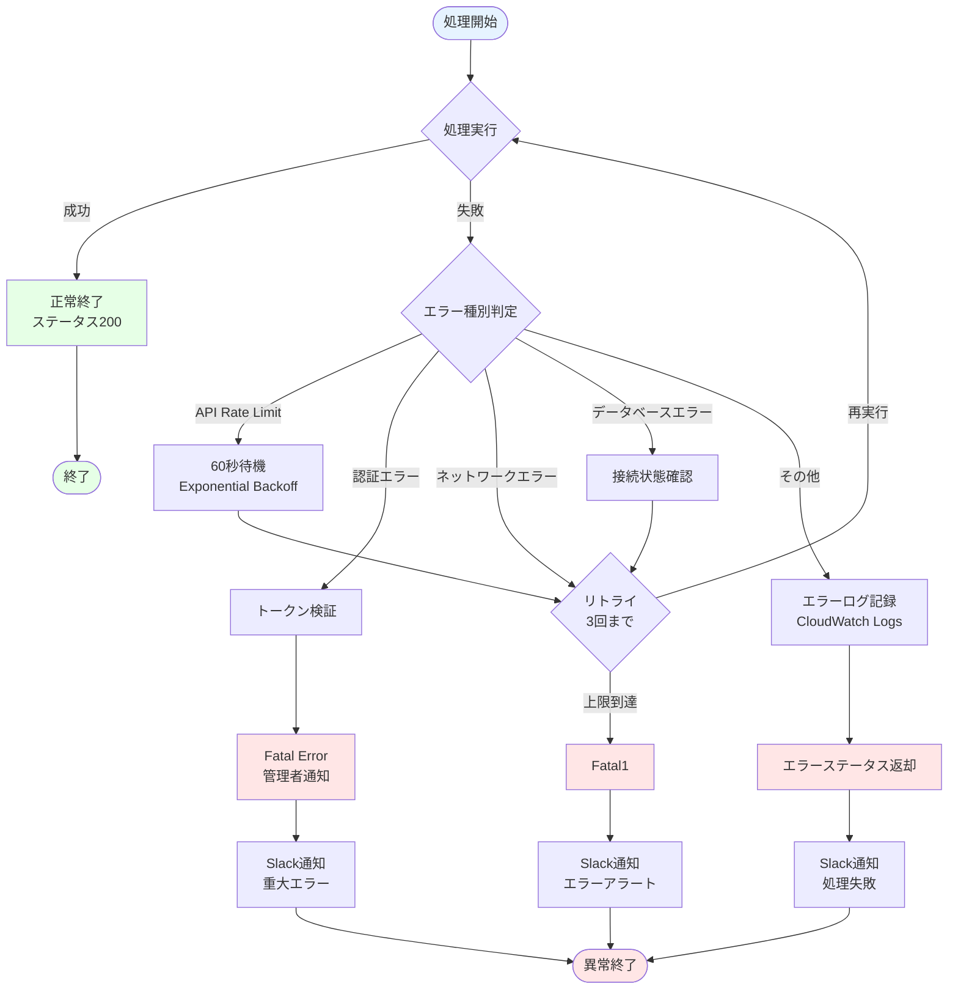
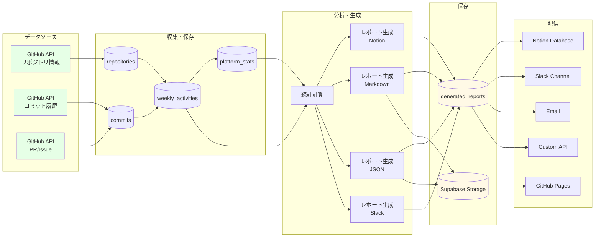
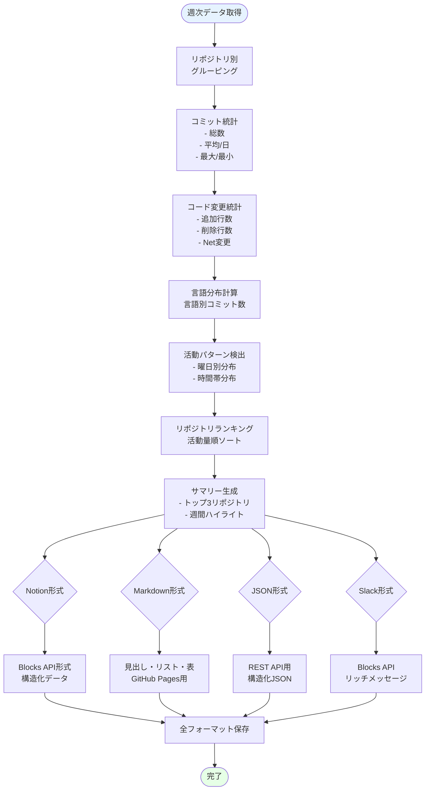

# GitHub Activity Aggregator - フロー図

このドキュメントは、GitHub Activity Aggregatorのシステム全体のフローを視覚化したものです。

---

## 📊 1. システム全体フロー



---

## 🔄 2. Lambda 1: GitHub Collector 詳細フロー



---

## 📝 3. Lambda 2: Report Generator 詳細フロー

```mermaid
flowchart TD
    Start([開始: Collector完了後]) --> Init[Supabase接続<br/>環境変数読込]
    Init --> GetPeriod[レポート期間設定<br/>先週月曜〜日曜]

    GetPeriod --> QueryDB[週次データ取得<br/>SELECT * FROM weekly_activities<br/>WHERE week_start >= 期間開始]

    QueryDB --> CheckData{データ<br/>存在?}
    CheckData -->|No| EmptyReport[空レポート生成<br/>「活動なし」メッセージ]
    EmptyReport --> End1([終了])

    CheckData -->|Yes| CalcStats[統計計算<br/>- アクティブリポジトリ数<br/>- 総コミット数<br/>- 総変更行数<br/>- 言語分布]

    CalcStats --> GenNotion[Notion形式生成<br/>- Database properties<br/>- Content blocks]
    GenNotion --> SaveNotion[generated_reports保存<br/>format='notion']

    SaveNotion --> GenMarkdown[Markdown形式生成<br/>- ヘッダー<br/>- 概要セクション<br/>- プロジェクト別詳細]
    GenMarkdown --> SaveMarkdown[generated_reports保存<br/>format='markdown']

    SaveMarkdown --> GenJSON[JSON形式生成<br/>構造化データ]
    GenJSON --> SaveJSON[generated_reports保存<br/>format='json']

    SaveJSON --> GenSlack[Slack形式生成<br/>- Blocks API<br/>- Markdown sections]
    GenSlack --> SaveSlack[generated_reports保存<br/>format='slack']

    SaveSlack --> Upload[Supabase Storage保存<br/>reports/{date}/]
    Upload --> TriggerNext[Publisher Lambda トリガー]
    TriggerNext --> End2([成功終了])

    style Start fill:#E6F3FF
    style End1 fill:#FFF9E6
    style End2 fill:#E6FFE6
```

---

## 📤 4. Lambda 3: Multi-Channel Publisher 詳細フロー

```mermaid
flowchart TD
    Start([開始: Generator完了後]) --> Init[Supabase接続<br/>環境変数読込]
    Init --> GetReports[最新レポート取得<br/>SELECT * FROM generated_reports<br/>ORDER BY created_at DESC<br/>LIMIT 4]

    GetReports --> CheckReports{レポート<br/>存在?}
    CheckReports -->|No| End1([終了: レポートなし])

    CheckReports -->|Yes| CheckNotion{Notion<br/>有効?}

    CheckNotion -->|Yes| PublishNotion[Notion API呼び出し<br/>POST /v1/pages]
    PublishNotion --> CheckNotionSuccess{成功?}
    CheckNotionSuccess -->|Yes| UpdateNotion[notion_page_id更新<br/>published_at記録]
    CheckNotionSuccess -->|No| LogNotionError[エラーログ記録]

    CheckNotion -->|No| CheckSlack
    UpdateNotion --> CheckSlack
    LogNotionError --> CheckSlack

    CheckSlack{Slack<br/>有効?} -->|Yes| PublishSlack[Slack Webhook呼び出し<br/>POST webhook URL]
    PublishSlack --> CheckSlackSuccess{成功?}
    CheckSlackSuccess -->|Yes| LogSlackSuccess[成功ログ記録]
    CheckSlackSuccess -->|No| LogSlackError[エラーログ記録]

    CheckSlack -->|No| CheckEmail
    LogSlackSuccess --> CheckEmail
    LogSlackError --> CheckEmail

    CheckEmail{Email<br/>有効?} -->|Yes| PublishEmail[SES経由メール送信]
    PublishEmail --> LogEmailResult[結果ログ記録]

    CheckEmail -->|No| CheckPages
    LogEmailResult --> CheckPages

    CheckPages{GitHub Pages<br/>有効?} -->|Yes| PublishPages[Markdownファイル<br/>リポジトリにコミット]
    PublishPages --> LogPagesResult[結果ログ記録]

    CheckPages -->|No| CheckWebhook
    LogPagesResult --> CheckWebhook

    CheckWebhook{Custom Webhook<br/>有効?} -->|Yes| PublishWebhook[Webhook送信<br/>POST custom URL]
    PublishWebhook --> LogWebhookResult[結果ログ記録]

    CheckWebhook -->|No| Summary
    LogWebhookResult --> Summary

    Summary[配信結果サマリー作成<br/>成功/失敗カウント] --> SaveResults[配信結果をDB保存]
    SaveResults --> End2([成功終了])

    style Start fill:#E6F3FF
    style End1 fill:#FFF9E6
    style End2 fill:#E6FFE6
    style LogNotionError fill:#FFE6E6
    style LogSlackError fill:#FFE6E6
```



---

## 🗄️ 5. データベース操作フロー



---

## ⏱️ 6. タイムラインフロー（週次実行）

```mermaid
gantt
    title 週次実行タイムライン（日曜 22:00〜）
    dateFormat  HH:mm
    axisFormat %H:%M

    section EventBridge
    トリガー発火           :milestone, m1, 22:00, 0m

    section Collector
    初期化                :a1, 22:00, 5s
    リポジトリ取得        :a2, after a1, 10s
    コミット詳細取得      :a3, after a2, 30s
    DB保存・集計          :a4, after a3, 15s

    section Generator
    データ読込            :b1, after a4, 5s
    統計計算              :b2, after b1, 5s
    レポート生成          :b3, after b2, 10s

    section Publisher
    配信処理              :c1, after b3, 10s
    結果記録              :c2, after c1, 5s

    section 完了
    全処理完了            :milestone, m2, after c2, 0m
```



---

## 🔐 7. エラーハンドリングフロー



---

## 🔄 8. データフロー（全体像）



---

## 📋 9. 実装フェーズフロー

```mermaid
graph TD
    Start([プロジェクト開始]) --> Phase1[Phase 1: 基盤構築<br/>- Supabase DB設計<br/>- Lambda基本実装<br/>- ローカルテスト]

    Phase1 --> Check1{動作<br/>確認}
    Check1 -->|NG| Phase1
    Check1 -->|OK| Phase2

    Phase2[Phase 2: データ収集<br/>- GitHub API統合<br/>- Collector実装<br/>- エラーハンドリング] --> Check2{テスト<br/>成功?}
    Check2 -->|NG| Phase2
    Check2 -->|OK| Phase3

    Phase3[Phase 3: レポート生成<br/>- Generator実装<br/>- 複数フォーマット対応<br/>- テンプレート作成] --> Check3{レポート<br/>品質OK?}
    Check3 -->|NG| Phase3
    Check3 -->|OK| Phase4

    Phase4[Phase 4: 配信機能<br/>- Publisher実装<br/>- API統合<br/>- 通知機能] --> Check4{配信<br/>成功?}
    Check4 -->|NG| Phase4
    Check4 -->|OK| Phase5

    Phase5[Phase 5: デプロイ<br/>- AWS CDK構築<br/>- CI/CD設定<br/>- 本番デプロイ] --> Check5{本番<br/>動作OK?}
    Check5 -->|NG| Phase5
    Check5 -->|OK| Phase6

    Phase6[Phase 6: 運用<br/>- モニタリング<br/>- 最適化<br/>- 機能拡張] --> Complete([完成])

    style Start fill:#E6F3FF
    style Complete fill:#E6FFE6
    style Check1 fill:#FFF9E6
    style Check2 fill:#FFF9E6
    style Check3 fill:#FFF9E6
    style Check4 fill:#FFF9E6
    style Check5 fill:#FFF9E6
```



---

## 📊 10. レポート生成詳細フロー



---

## 🎯 使用方法

このフロー図は、以下の用途で活用できます:

1. **実装前の設計確認** - システム全体の動作を理解
2. **実装中の参照** - 各Lambda関数の処理フローを確認
3. **デバッグ** - エラー発生時の処理フローを追跡
4. **ドキュメント** - チームや将来の自分への説明資料

---

## 📝 フロー図の見方

### 記号の意味
- **長方形**: 処理・アクション
- **菱形**: 条件分岐・判定
- **円柱**: データベース
- **楕円**: 開始・終了
- **矢印**: データ・制御の流れ

### 色の意味
- **青色**: 開始ポイント
- **緑色**: 成功・完了
- **黄色**: 中間状態・保留
- **赤色**: エラー・失敗

---

**最終更新**: 2025-11-17
