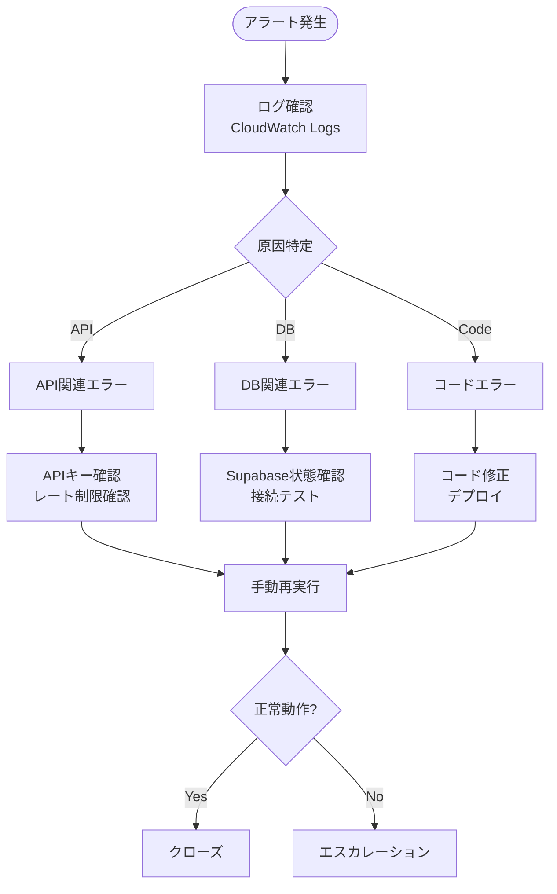

# GitHub Activity Aggregator - 運用・監視ガイド

**作成日**: 2025-11-20
**バージョン**: 1.0.0

---

## 目次

1. [運用概要](#運用概要)
2. [CloudWatch 監視設定](#cloudwatch-監視設定)
3. [アラート設定](#アラート設定)
4. [ダッシュボード](#ダッシュボード)
5. [ログ管理](#ログ管理)
6. [障害対応](#障害対応)
7. [定期メンテナンス](#定期メンテナンス)

---

## 運用概要

### SLA目標

| 指標 | 目標値 | 測定方法 |
|-----|-------|---------|
| 可用性 | 99.5% | 週次実行成功率 |
| 実行時間 | < 2分 | Lambda Duration |
| エラー率 | < 1% | Error count / Invocations |

### 運用体制

| 役割 | 担当 | 連絡先 |
|-----|------|-------|
| プライマリ | - | Slack: #alerts |
| セカンダリ | - | Email通知 |

---

## CloudWatch 監視設定

### メトリクス一覧

#### Lambda メトリクス

| メトリクス名 | 説明 | 閾値 |
|------------|------|------|
| Invocations | 実行回数 | - |
| Duration | 実行時間(ms) | < 60,000 |
| Errors | エラー数 | = 0 |
| Throttles | スロットル数 | = 0 |
| ConcurrentExecutions | 同時実行数 | < 10 |
| IteratorAge | (未使用) | - |

#### カスタムメトリクス

```typescript
// src/utils/metrics.ts
import { CloudWatchClient, PutMetricDataCommand } from '@aws-sdk/client-cloudwatch'

const cloudwatch = new CloudWatchClient({ region: 'ap-northeast-1' })

export async function putMetric(
  metricName: string,
  value: number,
  unit: 'Count' | 'Milliseconds' | 'Bytes' = 'Count',
  dimensions?: Record<string, string>
): Promise<void> {
  const command = new PutMetricDataCommand({
    Namespace: 'GitHubActivityAggregator',
    MetricData: [
      {
        MetricName: metricName,
        Value: value,
        Unit: unit,
        Timestamp: new Date(),
        Dimensions: dimensions
          ? Object.entries(dimensions).map(([Name, Value]) => ({ Name, Value }))
          : undefined,
      },
    ],
  })

  await cloudwatch.send(command)
}

// 使用例
await putMetric('RepositoriesProcessed', 25)
await putMetric('CommitsFetched', 150)
await putMetric('ReportGenerationTime', 5000, 'Milliseconds')
await putMetric('NotionPublishSuccess', 1, 'Count', { Channel: 'Notion' })
```

### CloudFormation 設定

```yaml
# cloudformation/monitoring.yaml
AWSTemplateFormatVersion: '2010-09-09'
Description: Monitoring resources for GitHub Activity Aggregator

Parameters:
  AlertEmail:
    Type: String
    Description: Email address for alerts
  SlackWebhookUrl:
    Type: String
    Description: Slack webhook URL for alerts
    NoEcho: true

Resources:
  # SNS Topic for alerts
  AlertTopic:
    Type: AWS::SNS::Topic
    Properties:
      TopicName: github-activity-alerts
      DisplayName: GitHub Activity Aggregator Alerts

  # Email subscription
  EmailSubscription:
    Type: AWS::SNS::Subscription
    Properties:
      TopicArn: !Ref AlertTopic
      Protocol: email
      Endpoint: !Ref AlertEmail

  # Lambda for Slack notification
  SlackNotifierFunction:
    Type: AWS::Lambda::Function
    Properties:
      FunctionName: github-activity-slack-notifier
      Runtime: nodejs20.x
      Handler: index.handler
      Role: !GetAtt SlackNotifierRole.Arn
      Environment:
        Variables:
          SLACK_WEBHOOK_URL: !Ref SlackWebhookUrl
      Code:
        ZipFile: |
          const https = require('https');
          exports.handler = async (event) => {
            const message = JSON.parse(event.Records[0].Sns.Message);
            const payload = {
              text: `🚨 *Alert*: ${message.AlarmName}\n${message.NewStateReason}`,
              attachments: [{
                color: message.NewStateValue === 'ALARM' ? 'danger' : 'good',
                fields: [
                  { title: 'Region', value: message.Region, short: true },
                  { title: 'Time', value: message.StateChangeTime, short: true }
                ]
              }]
            };

            const url = new URL(process.env.SLACK_WEBHOOK_URL);
            const options = {
              hostname: url.hostname,
              path: url.pathname,
              method: 'POST',
              headers: { 'Content-Type': 'application/json' }
            };

            return new Promise((resolve, reject) => {
              const req = https.request(options, (res) => resolve({ statusCode: res.statusCode }));
              req.on('error', reject);
              req.write(JSON.stringify(payload));
              req.end();
            });
          };

  SlackNotifierRole:
    Type: AWS::IAM::Role
    Properties:
      AssumeRolePolicyDocument:
        Version: '2012-10-17'
        Statement:
          - Effect: Allow
            Principal:
              Service: lambda.amazonaws.com
            Action: sts:AssumeRole
      ManagedPolicyArns:
        - arn:aws:iam::aws:policy/service-role/AWSLambdaBasicExecutionRole

  SlackSubscription:
    Type: AWS::SNS::Subscription
    Properties:
      TopicArn: !Ref AlertTopic
      Protocol: lambda
      Endpoint: !GetAtt SlackNotifierFunction.Arn

  SlackNotifierPermission:
    Type: AWS::Lambda::Permission
    Properties:
      FunctionName: !Ref SlackNotifierFunction
      Action: lambda:InvokeFunction
      Principal: sns.amazonaws.com
      SourceArn: !Ref AlertTopic

Outputs:
  AlertTopicArn:
    Value: !Ref AlertTopic
    Export:
      Name: AlertTopicArn
```

---

## アラート設定

### 重要アラート

```yaml
# cloudformation/alarms.yaml
Resources:
  # Lambda実行エラー
  CollectorErrorAlarm:
    Type: AWS::CloudWatch::Alarm
    Properties:
      AlarmName: github-activity-collector-errors
      AlarmDescription: Collector Lambda function errors
      MetricName: Errors
      Namespace: AWS/Lambda
      Dimensions:
        - Name: FunctionName
          Value: github-activity-collector
      Statistic: Sum
      Period: 300
      EvaluationPeriods: 1
      Threshold: 1
      ComparisonOperator: GreaterThanOrEqualToThreshold
      AlarmActions:
        - !ImportValue AlertTopicArn
      OKActions:
        - !ImportValue AlertTopicArn
      TreatMissingData: notBreaching

  # Lambda実行時間超過
  CollectorDurationAlarm:
    Type: AWS::CloudWatch::Alarm
    Properties:
      AlarmName: github-activity-collector-duration
      AlarmDescription: Collector Lambda execution time exceeds threshold
      MetricName: Duration
      Namespace: AWS/Lambda
      Dimensions:
        - Name: FunctionName
          Value: github-activity-collector
      Statistic: Average
      Period: 300
      EvaluationPeriods: 1
      Threshold: 55000  # 55秒（タイムアウト60秒）
      ComparisonOperator: GreaterThanThreshold
      AlarmActions:
        - !ImportValue AlertTopicArn

  # Lambdaスロットリング
  LambdaThrottleAlarm:
    Type: AWS::CloudWatch::Alarm
    Properties:
      AlarmName: github-activity-throttles
      AlarmDescription: Lambda functions are being throttled
      MetricName: Throttles
      Namespace: AWS/Lambda
      Statistic: Sum
      Period: 300
      EvaluationPeriods: 1
      Threshold: 1
      ComparisonOperator: GreaterThanOrEqualToThreshold
      AlarmActions:
        - !ImportValue AlertTopicArn

  # カスタムメトリクス - 処理リポジトリ数ゼロ
  NoRepositoriesAlarm:
    Type: AWS::CloudWatch::Alarm
    Properties:
      AlarmName: github-activity-no-repositories
      AlarmDescription: No repositories were processed
      MetricName: RepositoriesProcessed
      Namespace: GitHubActivityAggregator
      Statistic: Sum
      Period: 3600
      EvaluationPeriods: 1
      Threshold: 0
      ComparisonOperator: LessThanOrEqualToThreshold
      AlarmActions:
        - !ImportValue AlertTopicArn

  # 配信失敗
  PublishFailureAlarm:
    Type: AWS::CloudWatch::Alarm
    Properties:
      AlarmName: github-activity-publish-failure
      AlarmDescription: Failed to publish to one or more channels
      MetricName: PublishFailure
      Namespace: GitHubActivityAggregator
      Statistic: Sum
      Period: 3600
      EvaluationPeriods: 1
      Threshold: 1
      ComparisonOperator: GreaterThanOrEqualToThreshold
      AlarmActions:
        - !ImportValue AlertTopicArn
```

### アラート対応マトリクス

| アラート名 | 重要度 | 即時対応 | エスカレーション |
|-----------|-------|---------|----------------|
| collector-errors | 高 | ログ確認、手動再実行 | 30分後 |
| collector-duration | 中 | 次回実行を監視 | 2回連続で発生 |
| throttles | 中 | 同時実行制限確認 | - |
| no-repositories | 高 | GitHub Token確認 | 即時 |
| publish-failure | 中 | 配信先API確認 | 次回実行まで |

---

## ダッシュボード

### CloudWatch ダッシュボード定義

```yaml
# cloudformation/dashboard.yaml
Resources:
  MainDashboard:
    Type: AWS::CloudWatch::Dashboard
    Properties:
      DashboardName: GitHubActivityAggregator
      DashboardBody: !Sub |
        {
          "widgets": [
            {
              "type": "text",
              "x": 0,
              "y": 0,
              "width": 24,
              "height": 1,
              "properties": {
                "markdown": "# GitHub Activity Aggregator Dashboard"
              }
            },
            {
              "type": "metric",
              "x": 0,
              "y": 1,
              "width": 8,
              "height": 6,
              "properties": {
                "metrics": [
                  ["AWS/Lambda", "Invocations", "FunctionName", "github-activity-collector"],
                  [".", "Errors", ".", "."],
                  [".", "Throttles", ".", "."]
                ],
                "period": 86400,
                "stat": "Sum",
                "region": "${AWS::Region}",
                "title": "Collector - Daily Metrics"
              }
            },
            {
              "type": "metric",
              "x": 8,
              "y": 1,
              "width": 8,
              "height": 6,
              "properties": {
                "metrics": [
                  ["AWS/Lambda", "Duration", "FunctionName", "github-activity-collector", { "stat": "Average" }],
                  ["...", { "stat": "Maximum" }],
                  ["...", { "stat": "Minimum" }]
                ],
                "period": 86400,
                "region": "${AWS::Region}",
                "title": "Collector - Duration (ms)"
              }
            },
            {
              "type": "metric",
              "x": 16,
              "y": 1,
              "width": 8,
              "height": 6,
              "properties": {
                "metrics": [
                  ["GitHubActivityAggregator", "RepositoriesProcessed"],
                  [".", "CommitsFetched"]
                ],
                "period": 604800,
                "stat": "Sum",
                "region": "${AWS::Region}",
                "title": "Weekly - Data Collected"
              }
            },
            {
              "type": "metric",
              "x": 0,
              "y": 7,
              "width": 12,
              "height": 6,
              "properties": {
                "metrics": [
                  ["GitHubActivityAggregator", "NotionPublishSuccess", "Channel", "Notion"],
                  [".", "SlackPublishSuccess", ".", "Slack"],
                  [".", "PublishFailure"]
                ],
                "period": 604800,
                "stat": "Sum",
                "region": "${AWS::Region}",
                "title": "Weekly - Publish Status"
              }
            },
            {
              "type": "log",
              "x": 12,
              "y": 7,
              "width": 12,
              "height": 6,
              "properties": {
                "query": "SOURCE '/aws/lambda/github-activity-collector' | fields @timestamp, @message | filter @message like /ERROR/ | sort @timestamp desc | limit 20",
                "region": "${AWS::Region}",
                "title": "Recent Errors"
              }
            }
          ]
        }
```

### ダッシュボードURL

デプロイ後、以下のURLでアクセス可能:
```
https://ap-northeast-1.console.aws.amazon.com/cloudwatch/home?region=ap-northeast-1#dashboards:name=GitHubActivityAggregator
```

---

## ログ管理

### ログ保持期間設定

```yaml
# cloudformation/log-groups.yaml
Resources:
  CollectorLogGroup:
    Type: AWS::Logs::LogGroup
    Properties:
      LogGroupName: /aws/lambda/github-activity-collector
      RetentionInDays: 30

  GeneratorLogGroup:
    Type: AWS::Logs::LogGroup
    Properties:
      LogGroupName: /aws/lambda/github-activity-generator
      RetentionInDays: 30

  PublisherLogGroup:
    Type: AWS::Logs::LogGroup
    Properties:
      LogGroupName: /aws/lambda/github-activity-publisher
      RetentionInDays: 30
```

### ログ検索クエリ集

#### 基本クエリ

```sql
-- 最近のエラー
fields @timestamp, @message
| filter @message like /ERROR/
| sort @timestamp desc
| limit 50

-- 特定期間の実行ログ
fields @timestamp, @message
| filter @timestamp >= 1700000000000 and @timestamp <= 1700100000000
| sort @timestamp

-- メモリ使用量
fields @timestamp, @memorySize, @maxMemoryUsed
| filter @type = "REPORT"
| stats max(@maxMemoryUsed) as MaxMemory by bin(1d)
```

#### 監査ログクエリ

```sql
-- API呼び出し成功率
fields action, result
| filter level = "AUDIT"
| stats count(*) as total,
        sum(case when result = "success" then 1 else 0 end) as success
        by action
| display action, success, total, (success * 100 / total) as success_rate

-- リソース別エラー
fields @timestamp, action, resource, error
| filter level = "AUDIT" and result = "failure"
| stats count(*) by resource
| sort count desc

-- 時系列アクティビティ
fields @timestamp
| filter level = "AUDIT"
| stats count(*) by bin(1h)
```

### ログエクスポート（S3）

```yaml
Resources:
  LogExportBucket:
    Type: AWS::S3::Bucket
    Properties:
      BucketName: github-activity-logs-archive
      LifecycleConfiguration:
        Rules:
          - Id: ArchiveOldLogs
            Status: Enabled
            Transitions:
              - StorageClass: GLACIER
                TransitionInDays: 90
            ExpirationInDays: 365

  LogExportTask:
    Type: AWS::Logs::SubscriptionFilter
    Properties:
      LogGroupName: /aws/lambda/github-activity-collector
      FilterPattern: ""
      DestinationArn: !GetAtt LogExportBucket.Arn
```

---

## 障害対応

### 障害対応フロー



### トラブルシューティングガイド

#### エラー: GitHub API 401 Unauthorized

**原因**: トークンが無効または期限切れ

**対応手順**:
```bash
# 1. トークンの確認
aws secretsmanager get-secret-value \
  --secret-id github-activity-aggregator/github-token \
  --query SecretString --output text

# 2. GitHub APIで直接テスト
curl -H "Authorization: Bearer ghp_xxx" \
  https://api.github.com/user

# 3. 必要に応じてトークン再発行
# GitHub Settings > Developer settings > Personal access tokens
```

#### エラー: Supabase Connection Timeout

**原因**: ネットワーク問題またはSupabaseメンテナンス

**対応手順**:
```bash
# 1. Supabase Status確認
curl https://status.supabase.com/api/v2/summary.json

# 2. 接続テスト
curl "https://xxxxx.supabase.co/rest/v1/" \
  -H "apikey: eyJxxx" \
  -H "Authorization: Bearer eyJxxx"

# 3. Lambda再デプロイ（接続プール問題の場合）
aws lambda update-function-code \
  --function-name github-activity-collector \
  --zip-file fileb://function.zip
```

#### エラー: Claude API Rate Limit

**原因**: API呼び出し過多

**対応手順**:
```bash
# 1. Anthropic Console でUsage確認
# https://console.anthropic.com/settings/usage

# 2. コード修正（バッチサイズ縮小）
# src/claude/analyzer.ts の MAX_BATCH_SIZE を調整

# 3. リトライロジック確認
# Exponential backoff が正しく動作しているか
```

### 手動実行コマンド

```bash
# Collector Lambda手動実行
aws lambda invoke \
  --function-name github-activity-collector \
  --payload '{}' \
  --log-type Tail \
  --query 'LogResult' \
  --output text response.json | base64 -d

# Generator Lambda手動実行
aws lambda invoke \
  --function-name github-activity-generator \
  --payload '{}' \
  response.json

# Publisher Lambda手動実行
aws lambda invoke \
  --function-name github-activity-publisher \
  --payload '{}' \
  response.json
```

---

## 定期メンテナンス

### 週次タスク

| タスク | 実施日 | 担当 | 確認項目 |
|-------|-------|------|---------|
| ログ確認 | 月曜 | - | エラー・警告の確認 |
| メトリクス確認 | 月曜 | - | 実行時間・成功率 |
| Notion確認 | 月曜 | - | レポートが正しく投稿されているか |

### 月次タスク

| タスク | 実施日 | 担当 | 確認項目 |
|-------|-------|------|---------|
| コスト確認 | 1日 | - | AWS Cost Explorer確認 |
| ログ保持確認 | 1日 | - | 古いログが削除されているか |
| パフォーマンス分析 | 1日 | - | 実行時間トレンド |

### 四半期タスク

| タスク | 担当 | 確認項目 |
|-------|------|---------|
| APIキーローテーション | - | 全キーの更新 |
| IAMポリシーレビュー | - | 不要な権限の削除 |
| 依存パッケージ更新 | - | npm audit, npm update |

### メンテナンスチェックリスト

```markdown
## 週次チェックリスト

### ログ確認
- [ ] CloudWatch Logs でエラーがないか確認
- [ ] 実行時間が閾値内か確認
- [ ] メモリ使用量が適切か確認

### 動作確認
- [ ] Notionにレポートが投稿されているか
- [ ] Slackに通知が来ているか
- [ ] データベースにデータが保存されているか

### メトリクス
- [ ] 処理リポジトリ数が想定通りか
- [ ] コミット取得数が想定通りか
- [ ] エラー率が0%か

---

## 月次チェックリスト

### コスト
- [ ] Lambda: $0（無料枠内）
- [ ] CloudWatch: $X
- [ ] Secrets Manager: $X
- [ ] 合計: 予算内か

### セキュリティ
- [ ] IAMロールの権限レビュー
- [ ] シークレットのアクセスログ確認
- [ ] 不審なアクティビティがないか

### パフォーマンス
- [ ] 平均実行時間
- [ ] 最大実行時間
- [ ] メモリ使用率
```

---

## コスト管理

### 予想月額コスト

| サービス | 使用量 | コスト |
|---------|-------|-------|
| Lambda | 12回/月 × 60秒 | $0 |
| CloudWatch Logs | 100MB | $0.50 |
| CloudWatch Metrics | 10カスタムメトリクス | $3.00 |
| Secrets Manager | 4シークレット | $1.60 |
| SNS | 10通知 | $0 |
| **合計** | | **約$5/月** |

### コスト最適化

1. **ログ保持期間**: 30日に設定（デフォルト無期限）
2. **メトリクス解像度**: 1分 → 5分
3. **Lambda メモリ**: 必要最小限（512MB）
4. **同時実行**: 予約なし（オンデマンド）

---

**次のステップ**: [API_SPECIFICATION.md](./API_SPECIFICATION.md) でAPI仕様を確認
